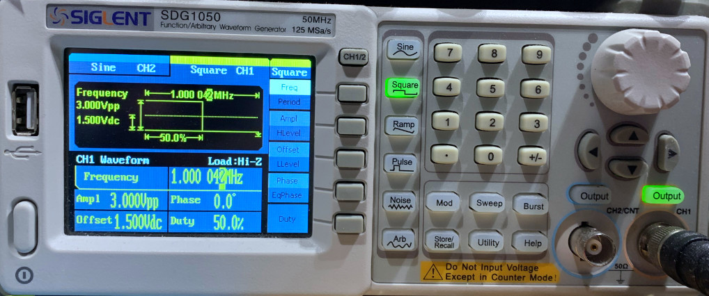
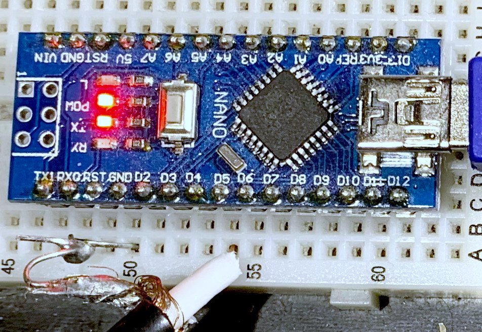
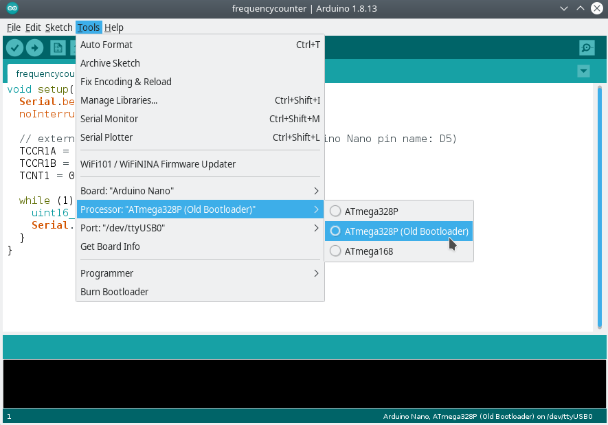

# Arduino Nano frequency counter with atomic clock accuracy

## Project description and test setup
With this project you can measure a frequency from less than 1 Hz to about 7.5 MHz, with atomic clock accuracy. All you need for it is your computer, and an Arduino Nano, which you can get for less than five dollars at eBay.

The idea is that the Arduino counts pulses, and then a program on your computer calculates the frequency. If your computer is synchronized to a NTP time server (this is standard nowadays for most operating systems), it has a very accurate time. The USB connection and operating system introduces some inaccuracies and latencies, but the longer the program runs, the more accurate the measurement gets.

Test setup with a SDG150 signal generator:



Arduino Nano breadboard setup:



Measured data after a few seconds is already about 0.05% accurate (500 ppm):

```
time: 0.0 s, frequency: 0 Hz, delta: 0 Hz, counts: 0
time: 1.0 s, frequency: 999,470.878 Hz, delta: -999470.878 Hz, counts: 999,615
time: 2.0 s, frequency: 1,000,848.773 Hz, delta: -1377.895 Hz, counts: 2,001,976
time: 3.0 s, frequency: 1,000,125.175 Hz, delta: 723.598 Hz, counts: 3,000,748
time: 4.0 s, frequency: 999,959.166 Hz, delta: 166.009 Hz, counts: 4,000,346
time: 5.0 s, frequency: 1,000,420.486 Hz, delta: -461.32 Hz, counts: 5,002,709
time: 6.0 s, frequency: 1,000,267.306 Hz, delta: 153.18 Hz, counts: 6,002,343
```

The longer it runs, the better it gets. After a few hours, the accuracy is better than 20 ppb (ppb=parts per billion, 0.000002%):

```
time: 12860.6 s, frequency: 1,000,043.062 Hz, delta: 0.1 Hz, counts: 12,861,168,998
time: 12861.6 s, frequency: 1,000,042.968 Hz, delta: 0.094 Hz, counts: 12,862,167,948
time: 12862.6 s, frequency: 1,000,042.936 Hz, delta: 0.032 Hz, counts: 12,863,167,687
time: 12863.6 s, frequency: 1,000,043.087 Hz, delta: -0.151 Hz, counts: 12,864,169,841
time: 12864.6 s, frequency: 1,000,042.983 Hz, delta: 0.104 Hz, counts: 12,865,168,701
time: 12865.6 s, frequency: 1,000,042.948 Hz, delta: 0.035 Hz, counts: 12,866,168,430
time: 12866.6 s, frequency: 1,000,043.101 Hz, delta: -0.153 Hz, counts: 12,867,170,571
```

Important: The accuracy depends on the number of counts and the runtime. For low frequencies, it needs longer to be accurate. For example for 1.5 Hz, it is only about 10% accurate after a few seconds:

```
time: 0.0 s, frequency: 0 Hz, delta: 0 Hz, counts: 0
time: 1.0 s, frequency: 1 Hz, delta: -1 Hz, counts: 1
time: 2.0 s, frequency: 1.5 Hz, delta: -0.5 Hz, counts: 3
time: 3.0 s, frequency: 1.333 Hz, delta: 0.167 Hz, counts: 4
time: 4.0 s, frequency: 1.5 Hz, delta: -0.167 Hz, counts: 6
time: 5.0 s, frequency: 1.4 Hz, delta: 0.1 Hz, counts: 7
time: 6.0 s, frequency: 1.5 Hz, delta: -0.1 Hz, counts: 9
```

You can also use the program as an event counter. It increments the `counts` value for each high to low change on the input pin.

## Program the Arduino Nano
Start the Arduino IDE, open the Arduino script in the `arduino/frequencycounter` directory, select the Arduino Nano board, and flash it as usual. Note: some of these cheap Arduino clones from China might need the old bootloader:



Then connect the signal to measure to pin D5.

**Important: The Arduino Nano runs with 3.3 V. The input signal must be between 0 V and 3.3 V, and for best measurement results, it should be a square wave signal. You can add some input protection and a Schmitt-Trigger to protect and condition the input signal, if required.**

## How to compile and use the program on the computer side
The computer program is written in Rust and should run on Linux, Mac, and Windows (tested only on Linux so far). To compile it, first install Rust, e.g. from https://rustup.rs. Then change to the `rust/frequencycounter` directory on the command line and build it with `cargo build --release`. You should see something like this:
```
frank@hal9000:~/data/projects/frequencycounter/rust/frequencycounter$ cargo build --release
    Updating crates.io index
   Compiling libc v0.2.107
   Compiling pkg-config v0.3.22
   Compiling nix v0.16.1
   Compiling void v1.0.2
   Compiling cfg-if v0.1.10
   Compiling bitflags v1.3.2
   Compiling separator v0.4.1
   Compiling libudev-sys v0.1.4
   Compiling libudev v0.2.0
   Compiling serialport v4.0.1
   Compiling frequencycounter v0.1.0 (/home/frank/data/projects/frequencycounter/rust/frequencycounter)
    Finished release [optimized] target(s) in 9.32s
```
Then you can start it. If you start it without a command line parameter, you can see a list of all available serial ports:
```
frank@hal9000:~/data/projects/frequencycounter/rust/frequencycounter$ ./target/release/frequencycounter 
usage: ./target/release/frequencycounter port
available ports:
/dev/ttyUSB0
```
If you have more than one, unplug the Arduino and check again to see which one is the right one.

If you start it with the port name as a command line argument, it starts measuring. You can use the `tee` command to see the measurement on the command line, and log it to a file at the same time:
```
frank@hal9000:~/data/projects/frequencycounter/rust/frequencycounter$ ./target/release/frequencycounter /dev/ttyUSB0 | tee log.txt
time: 0.0 s, frequency: 0 Hz, delta: 0 Hz, counts: 0
time: 1.0 s, frequency: 999,445.946 Hz, delta: -999445.946 Hz, counts: 999,600
time: 2.0 s, frequency: 1,000,772.975 Hz, delta: -1327.029 Hz, counts: 2,001,858
time: 3.0 s, frequency: 1,000,099.088 Hz, delta: 673.887 Hz, counts: 3,000,742
time: 4.0 s, frequency: 999,941.637 Hz, delta: 157.451 Hz, counts: 4,000,340
```
You can stop the program with `ctrl-c`.
